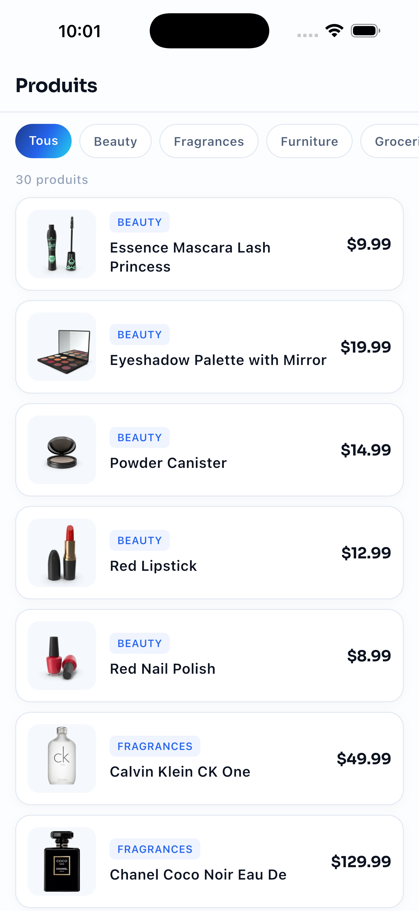

# izistacks_products

Test technique Flutter : une liste de produits récupérée depuis une API, avec les états loading / erreur et un pull-to-refresh. L'habillage reprend les couleurs et les polices de izistacks.com.



## Lancer

```
flutter pub get
flutter run
```

Les tests :

```
flutter test
```

## Organisation

```
lib/
  main.dart
  theme/izi_theme.dart        couleurs, polices, ThemeData
  models/product.dart         Product + parsing json
  services/product_service.dart   appel API (dummyjson.com)
  pages/products_page.dart    l'écran
assets/fonts/                 Sora et Figtree (Google Fonts, OFL)
test/
  products_page_test.dart     tests widget (client http mocké)
  product_test.dart
  screenshot_test.dart        captures, skippé par défaut
```

## Notes

- pas de state management, un StatefulWidget suffit pour un seul écran
- le client http est injectable dans le service (et le service dans la page) pour tester sans réseau
- timeout de 10s sur la requête
- si le pull-to-refresh échoue on garde la liste affichée et on montre un snackbar, l'écran d'erreur est réservé au chargement initial
- le filtre par type est fait côté client sur les produits déjà chargés
- l'état vide reste scrollable pour que le pull-to-refresh marche aussi

## Couleurs du site

| | |
|---|---|
| texte | `#0B1220`, secondaire `#51607A`, atténué `#93A1B7` |
| fond | `#FBFDFF`, blocs `#F5F8FC`, bordures `#E3E9F2` |
| bleu | `#2563EB` |
| dégradé du logo | `#1E3A8A` > `#2563EB` > `#22D3EE` |
| polices | Sora pour les titres et les prix, Figtree pour le reste |
